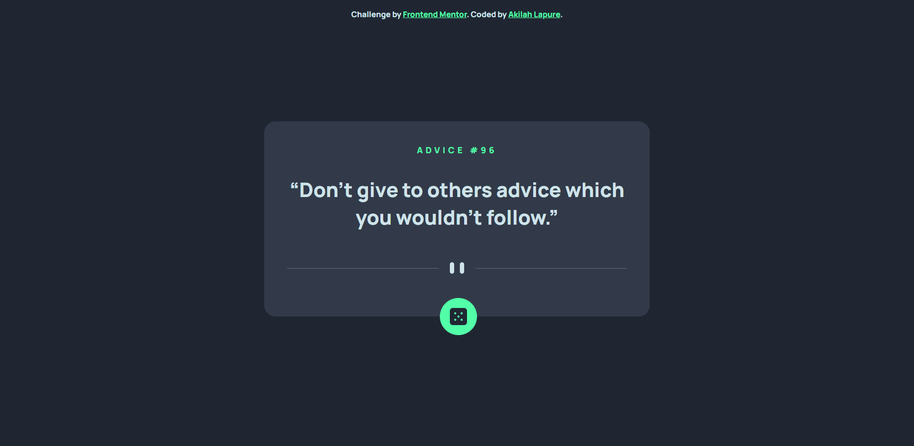
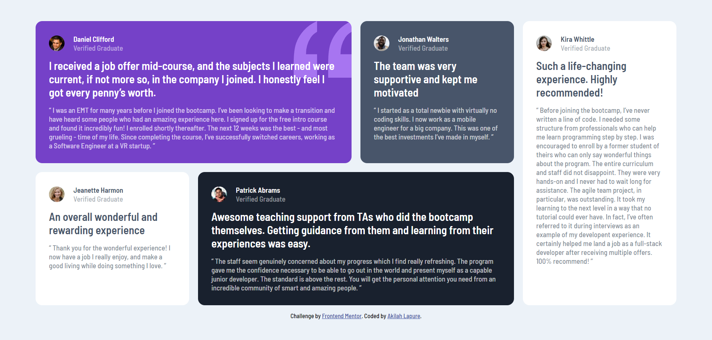
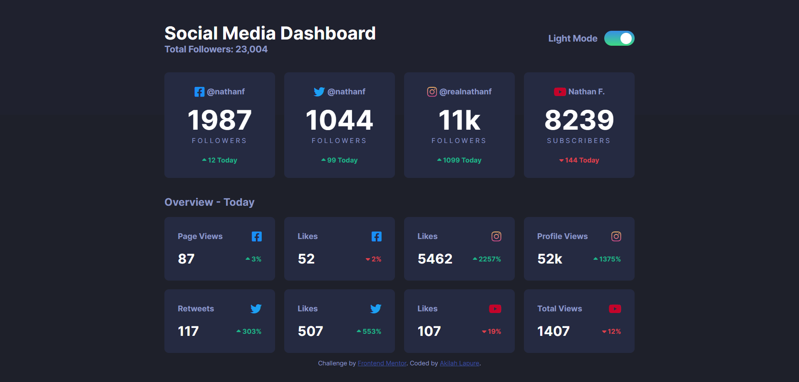
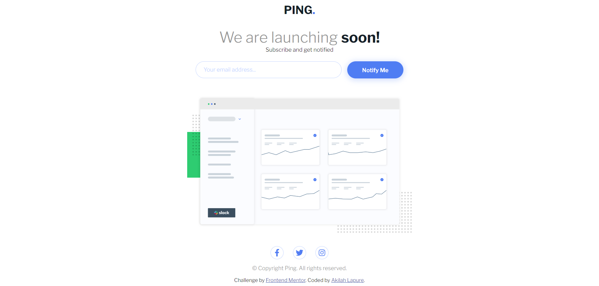
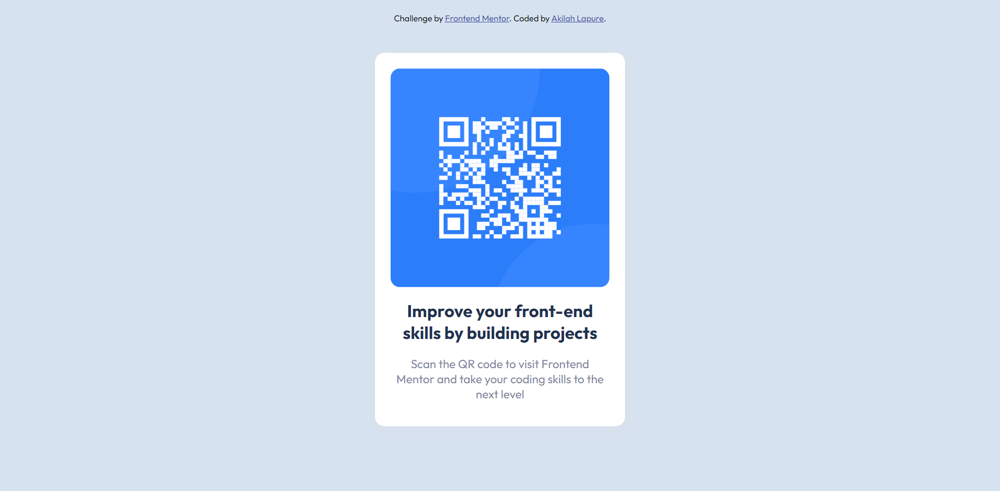

# Frontend Mentor Solutions

This repository is a collection of my completed solutions for the frontend mentor challenges! I use Frontend Mentor to practice my skills on HTML, CSS and JS. Other than that, I also use it to look for web apps and projects I can try developing.
## Table of contents

- [Challenges](#challenges)
    - [Advice Generator App](#advice-generator-app)
    - [Testimonials Grid Section](#testimonials-grid-section)
    - [Social Media Dashboard With Theme Switcher](#social-media-dashboard-with-theme-switcher)
    - [Ping Coming Soon Page](#ping-coming-soon-page)
    - [QR Code Component](#qr-code-component)
- [Author](#author)

## Challenges
### Advice Generator App

[(Back to top)](#table-of-contents)

- [Code](https://github.com/akilahlapure/frontend-mentor/tree/main/advice-generator-app-main)
- [Live URL](https://byooki-advice-generator.netlify.app/)

### Testimonials Grid Section

[(Back to top)](#table-of-contents)

- [Code](https://github.com/akilahlapure/frontend-mentor/tree/main/testimonials-grid-section-main)
- [Live URL](https://byooki-testimonials-grid.netlify.app/)

### Social Media Dashboard With Theme Switcher

- [Code](https://github.com/akilahlapure/frontend-mentor/tree/main/social-media-dashboard-with-theme-switcher)
- [Live URL](https://byooki-social-media-dashboard.netlify.app/)

### Ping Coming Soon Page

[(Back to top)](#table-of-contents)

- [Code](https://github.com/akilahlapure/frontend-mentor/tree/main/ping-coming-soon-page-master)
- [Live URL](https://byooki-ping-coming-soon-page.netlify.app/)

### QR Code Component

[(Back to top)](#table-of-contents)

- [Code](https://github.com/akilahlapure/frontend-mentor/tree/main/qr-code-component-main)
- [Live URL](https://byooki-qr-code-component.netlify.app/)

## Author

- Frontend Mentor - [@akilahlapure](https://www.frontendmentor.io/profile/akilahlapure)

