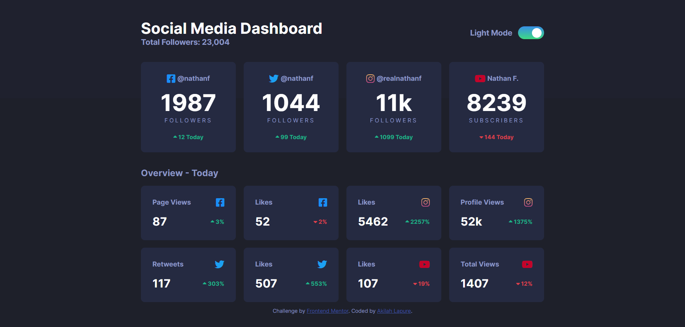

# Frontend Mentor - Social media dashboard with theme switcher solution

This is a solution to the [Social media dashboard with theme switcher challenge on Frontend Mentor](https://www.frontendmentor.io/challenges/social-media-dashboard-with-theme-switcher-6oY8ozp_H). Frontend Mentor challenges help you improve your coding skills by building realistic projects. 

## Table of contents

- [Overview](#overview)
  - [The challenge](#the-challenge)
  - [Screenshot](#screenshot)
  - [Links](#links)
- [My process](#my-process)
  - [Built with](#built-with)
- [Author](#author)
- [Acknowledgments](#acknowledgments)

## Overview

### The challenge

Users should be able to:

- View the optimal layout for the site depending on their device's screen size
- See hover states for all interactive elements on the page
- Toggle color theme to their preference

### Screenshot

### Links

- Solution URL: [GitHub](https://github.com/akilahlapure/frontend-mentor/tree/main/social-media-dashboard-with-theme-switcher)
- Live Site URL: [Netlify](https://byooki-social-media-dashboard.netlify.app/)

## My process

### Built with

- Semantic HTML5 markup
- CSS custom properties
- SCSS
- Flexbox
- CSS Grid

## Author

- Frontend Mentor - [@akilahlapure](https://www.frontendmentor.io/profile/akilahlapure)

## Acknowledgments

- Toggle Button by Marcus Burnette - [CodePen](https://codepen.io/mburnette/pen/LxNxNg?editors=1100)
- Theme Switch Tutorial by DesignCourse - [YouTube](https://youtu.be/ZKXv_ZHQ654)

